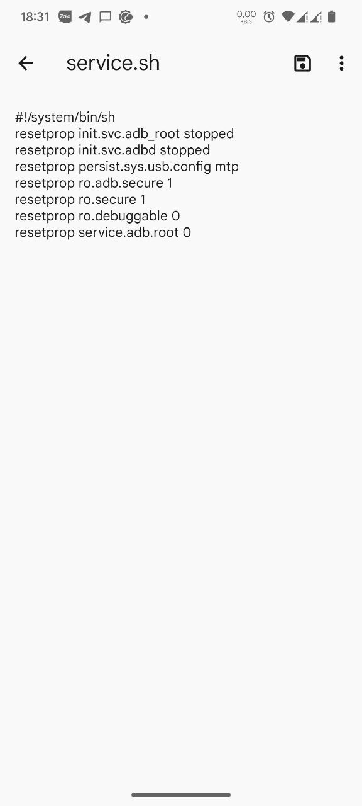
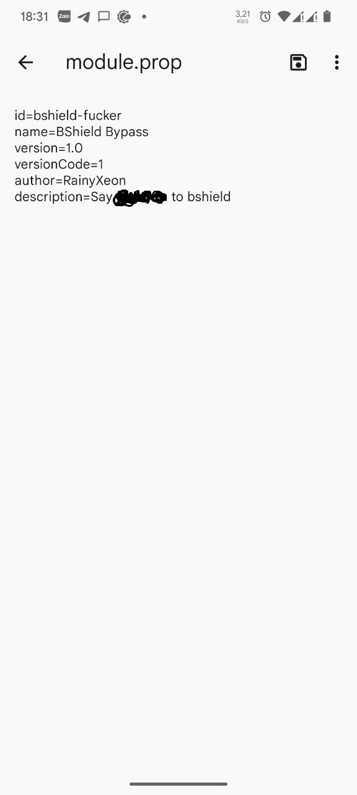
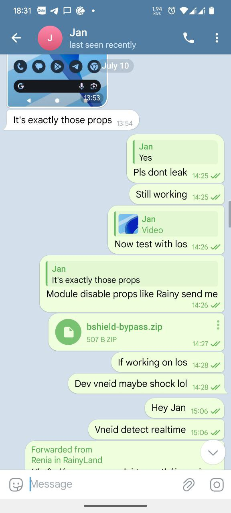
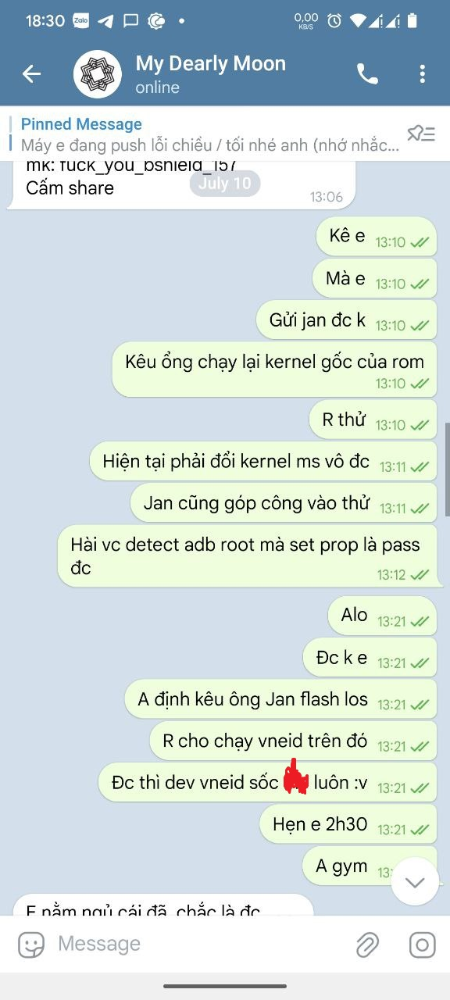
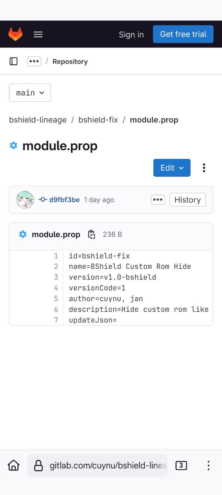
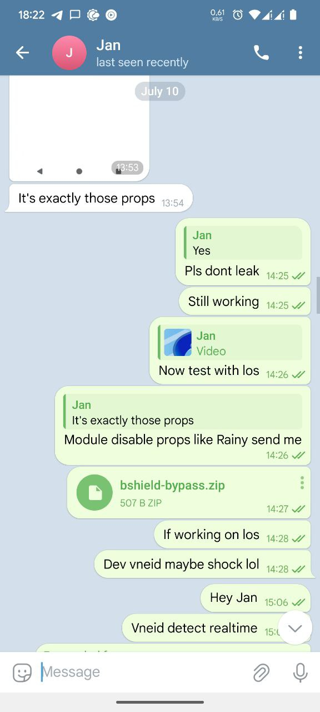
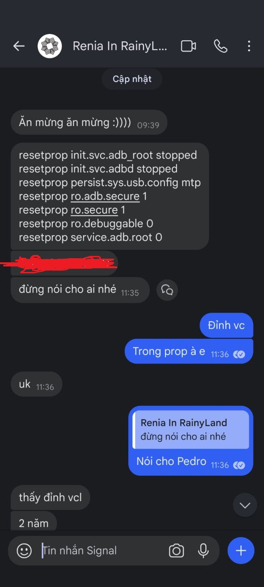
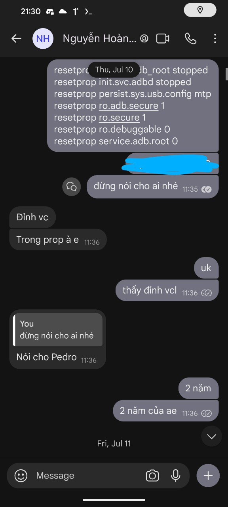

# Project reclaim

This md file is mostly we want to reclaim of my work since Cuynu post it but keep his name like he's contributing for our project

We respect all of his project like MBCP which is a defferent ways to use MB Bank app if you can't hide root currently. We also respect that we added Rainy a an author after adding his issues. But that early test module cuynu post is a works of Jan, Rainy and S*X (I mostly call him Phenomica) only. These people who works for months to check what BSheild detects and go through this.

We write this md file to hope [Cuynu](https://github.com/cuynu) can help us to remove this repo and return the research / development to us:

- <http://cuynutt.ddns.net/cuynu/bshield-lineage>
- <https://gitlab.com/cuynu/bshield-lineage>
- <https://git.disroot.org/cuynu/bshield-lineage>

If Cuynu or any people have any issues with me aboout this project or need more explaination, feel free to contact me on support channel I list in [README.md](../README.md)

Or if Cuynu still don't want to remove, don't worry since people will recognize this project as my work with some proof image I list below.

## Image Proof or Work

Here's some image that get from older phone about the first time found that interestingly easy fix.

Some message I need to hide because I curse a bit much so I have to hide it.

If you want some original images, feel free to contact me on support channel I list in [README.md](../README.md) so I can give you.

You can see in this images, it's from July 10, 2025 which 3 days before Cuynu [first commit in bshield module](https://git.disroot.org/cuynu/bshield-lineage/commit/d9fbf3be6ad50e1fa684cee9f998701e33ca0009.patch)

Most of image extracted from this issues in his repo: <https://gitlab.com/cuynu/bshield-lineage/-/issues/1>

||||
|-|-|-|
||||
||||
||||

## After words

At the end, we want to cuynu also know that sometimes you need to rethink twice before posing anything that someone shared for you. It's often not your works and maybe not even the people who share you. Hope in the days ahead, you don't have to experience this in the future. Now we respectfully wants you to do what we said in the section above.

Best regards,

RainyXeon / DeepinRain
